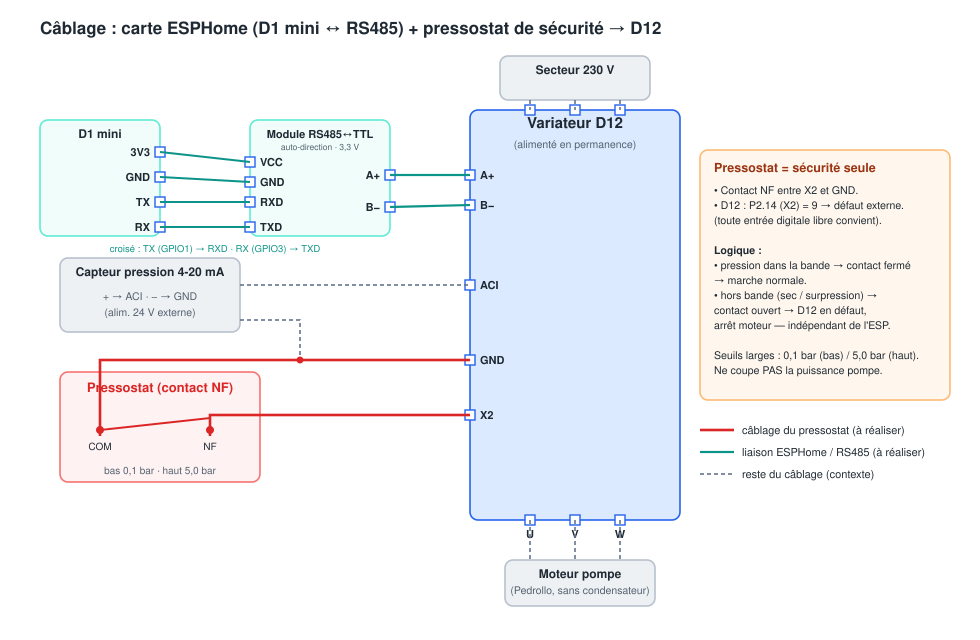

# Dual-Mode Control — Heat-pump (PAC) / Irrigation with automatic detection

This document describes the `dual-mode-control.yaml` ESPHome package, which turns the
D12 + D1 mini into an autonomous variable-speed pump controller serving **two uses**
from the same 100 L buffer tank:

- **PAC mode** — the ground-source heat pump draws well water through a low-resistance
  exchanger. Goal: lowest energy (≈144 W) at a low fixed economy frequency.
- **Irrigation mode** — sprinklers/nozzles, a high-resistance circuit. Goal: regulated
  pressure (≈2.5 bar) with automatic sleep when taps are closed.

The two uses are told apart **automatically**, from the hydraulics alone — no extra wire
to the heat pump.

Do **not** use the heat-pump "demand" signal as a direct pump-start command: on this
installation that same signal also drives the exchanger valve during the heat pump's
power-on purge, so it is not a clean indication of a real heating draw. The restored
external start condition is the pressostat low-threshold contact; PAC/irrigation
classification remains hydraulic.

> The package is optional and self-contained. It is loaded from the main config via
> `packages: dual_mode: !include dual-mode-control.yaml`. Comment that line to disable it.

---

## 1. Principle of automatic detection

Both consumers draw a **similar flow** (PAC ≈ 2.44 m³/h, irrigation ≈ 2.0 m³/h), so the
*rate of pressure drop* does **not** distinguish them. What differs by ~6× is the
**hydraulic resistance** of the active circuit:

| | Circuit | Resistance | Pressure at a fixed frequency |
|---|---|---|---|
| **PAC** | exchanger, large bore | low ("soft") | **low** (~0.4–1 bar) |
| **Irrigation** | nozzles | high ("stiff") | **high** (≈2.5 bar) |

So the controller **imposes a reference probe frequency** (`F probe`, ~38 Hz) for a few
seconds at start-up and reads the resulting **operating point** (steady pressure +
current):

- low pressure + real current ⇒ **PAC** → economy fixed-frequency mode;
- high pressure ⇒ **irrigation** → PID pressure regulation to the setpoint;
- high pressure + negligible current ⇒ **no draw** → go back to sleep.

The buffer tank only adds a short settling delay; at equilibrium it does not hide the
consumer's signature.

---

## 2. Architecture

- **Brain = ESPHome** (`P0.02 = Communication`, `P0.03 = Communication`): start/stop,
  mode detection, frequency command, PID, sleep. All logic is visible and tunable from
  Home Assistant.
- **External demand = pressure contact, not PAC demand**: the signal exposed to the pump
  side is the pressostat low-threshold contact. The raw heat-pump demand contact is not
  used as a direct start input because it also actuates the exchanger valve during purge.
- **Independent hardware safety net = the mechanical pressure switch** wired to the D12
  *external-fault* input, set at **wide limits (0.1 / 5.0 bar)** — dry-run and
  over-pressure protection that works **even if the ESP fails**. Plus the D12's own
  over-current / over-temperature protections.

This is the design chosen for this installation: a flexible software brain plus a simple
hardware guardian.

---

## 3. State machine

State names map to the `DM État` text sensor: **Repos** (IDLE), **Détection** (PROBE),
**PAC (éco)**, **Arrosage (PID)**, **Anti-court-cycle** (COOLDOWN).

### Mode selector (`DM Mode`)

| Option | Behaviour |
|---|---|
| **Auto** | full automatic detection (probe → PAC or Irrigation) |
| **PAC** | force economy fixed-frequency mode (skip probe) |
| **Arrosage** | force PID pressure regulation (skip probe) |
| **Off** | controller idle, pump kept stopped — **default after a fresh flash** |

---

## 4. Tunable parameters (Home Assistant)

| Entity | Default | Meaning |
|---|---|---|
| `DM P start (marche)` | 1.5 bar | pressure below which a cycle starts |
| `DM P stop (arrêt PAC)` | 2.0 bar | PAC fill/stop target (draw-ended detection) |
| `DM P consigne arrosage` | 2.5 bar | irrigation PID setpoint |
| `DM F éco PAC` | 38 Hz | fixed economy frequency in PAC mode |
| `DM F sonde (détection)` | 38 Hz | reference frequency during detection |
| `DM P seuil classification` ⚙️ | 1.4 bar | **calibrate** — PAC below / irrigation above, at F probe |
| `DM I mini débit` ⚙️ | 0.3 A | **calibrate** — min current proving a real draw |
| `DM F max` | 50 Hz | upper frequency limit |
| `DM F min (plancher sleep)` | 22 Hz | lower frequency / sleep floor |
| `DM PID Kp (Hz par bar)` | 8.0 | irrigation PID proportional gain |
| `DM PID Ki (Hz par bar.s)` | 2.0 | irrigation PID integral gain |

Fixed timers (in the lambda): probe 10 s, min run 60 s, min off 90 s, sleep delay 45 s,
max run 20 min (runaway guard).

The 11 parameters carry `entity_category: config` (grouped under *Configuration* on the
device page); `DM État` / `DM Mode détecté` are `diagnostic`. A ready-made dashboard with
an explicit description of every parameter — Home Assistant has no native hover tooltip —
is provided in **[lovelace-dual-mode.yaml](lovelace-dual-mode.yaml)** (legend card +
adjustable controls, no add-on required).

---

## 5. Use-case timing diagrams

### Case A — PAC cycle (Auto)
Detection finds a soft circuit, the pump runs at the economy frequency, fills the tank,
stops at `P stop`, then waits out the anti-short-cycle delay.

### Case B — Irrigation with sleep / wake
Detection finds a stiff circuit, the PID holds 2.5 bar; when the tap closes the frequency
falls to `F min`, and after 45 s the pump sleeps. Reopening a tap wakes it.

### Case C — PAC purge ride-through
At every power-up the heat pump runs a ~3 min air purge with intermittent short draws.
Because start/stop is driven by **tank pressure / the pressostat low-threshold
condition** rather than by the raw heat-pump demand signal, the exchanger-valve purge
does not become a direct pump-start command. The anti-short-cycle timer caps restarts,
and the saw-tooth purge is absorbed by the buffer tank.

### Case D — Communication-loss safety
If the D12 stops answering, the raw Modbus registers read NaN; the "comms-alive" guard
forces the pump OFF and the state back to Repos. The guard checks the raw registers
`aci_input` (0x2108) / `output_frequency`, not the derived `Pressure` sensor.

---

## 6. Commissioning & calibration

Do this **in order**:

1. **Hardware safety first** — wire the mechanical pressure switch (0.1 / 5.0 bar) to the
   D12 external-fault input. Do not run automatically before this is in place.
2. **Pressure** — wire the 4-20 mA sensor to ACI/GND and set the AI jumper to current
   (Cin); ESPHome reads it directly from register `0x2108` (raw ACI), no PID/analog
   scaling on the D12 needed.
3. **D12 parameters** — `P6.01 = 0000` (**9600**, the only supported rate), `P6.00 = 1`,
   then for ESPHome control `P0.02 = 2` and `P0.03 = 6`.
4. **Calibrate detection** — run the pump at `F probe` (38 Hz) once in **PAC only** and
   once in **irrigation only**; read the steady pressure each time. Set
   `DM P seuil classification` halfway between them. Read the running current to set
   `DM I mini débit`.
5. **Go live** — keep `DM Mode = Off`, then switch to `Auto`; watch `DM État` and
   `DM Mode détecté`. Tune `Kp` / `Ki` if the irrigation pressure oscillates.

---

## 7. Safety summary

- **Default mode `Off`** on a fresh device — never auto-runs the pump until explicitly set
  to `Auto`.
- **Comms-alive guard** — no pump command unless the D12 is answering.
- **Anti-short-cycle** (min on/off) and **max-run** software guards.
- **Mechanical pressure switch** at wide limits = independent hardware protection.
- These software guards do **not** replace the hardware pressure switch.

Wiring — ESPHome link (D1 mini ↔ RS485 ↔ D12) and the safety pressure switch
(NC contact → D12 external-fault input X2, `P2.14 = 9`):

---

## 8. Wiring note (RS485 module)

This installation uses an **auto-direction** RS485↔TTL module (MAX485 + direction-control
IC, 3.3 V / 5 V compatible). There is **no DE/RE pin** to wire, so ESPHome's
`flow_control_pin: GPIO5` is unused and can be removed (freeing GPIO5). Power the module
at **3.3 V** so logic levels match the D1 mini. See the main [README](../README.md#wiring-connections)
for the full pinout.

If the fitted module is instead a manual MAX485-style board with DE and /RE pins, tie
DE and /RE together, wire them to one ESP GPIO, and configure ESPHome
`flow_control_pin`. Without that direction control, the module can transmit requests but
stay unable to receive replies.

---

## 9. D12 parameter checklist

**Do not trust the factory defaults** — not all of them match what the integration
expects. On this unit, `P6.01` was found at `0000` (9600 bps), **not** the documented
`0001` (19200), which broke all Modbus communication. Verify every parameter below.
⚠️ marks values that must **differ from the factory default**.

### 9.1 Communication (required to talk at all)

| Param | Required | Default | Note |
|---|---|---|---|
| **P6.00** local address | **1** | 1 | must equal `modbus_address` (1) |
| **P6.01** comm config | **0000** | 0001 | ⚠️ ZT-D12-220V is **9600-only** — ones digit `1`/`2` are *reserved*, **not** 19200/38400. `0000` = 9600, no parity, normal response. ESPHome `baud_rate` must be **9600** too. Power-cycle the D12 after a baud change. |
| P6.02 timeout | 10.0 s | 10.0 s | ok (0 disables) |

Digit map of P6.01 = `[thousands][hundreds][tens][ones]`: ones = baud (**0=9600**; 1,2 reserved),
tens = parity (0=none), hundreds = response (0=normal, 2=no reply).

### 9.2 Frequency scaling (so commanded Hz is correct)

| Param | Required | Note |
|---|---|---|
| **P0.04** max frequency | **50.0 Hz** | ESPHome sends the setpoint as **% of P0.04**; must match `DM F max` (50) or every Hz is wrong. Verify. |
| **P0.05** upper limit | 50.0 Hz | consistency |

### 9.3 Pressure reading — register 0x2108 (raw ACI)

The ZT-D12-220V exposes the raw analog inputs over Modbus, so ESPHome reads the 4-20 mA
sensor **directly from `0x2108` (ACI, value in mA ×100)** — no PID feedback channel and no
analog scaling on the D12 are required.

| Item | Required | Note |
|---|---|---|
| **AI jumper J5** | **Cin (current)** | hardware — required for the 4-20 mA loop |
| 4-20 mA sensor | wired to **ACI / GND** | + external 24 V supply |

ESPHome does the scaling (`(mA − 4) / 16 × range_bar`, default 10 bar full scale).
`P3.00`, `P2.04–P2.07` and `P3.18` are **no longer needed** for the reading (they only
matter if you use the D12's own internal PID). This also removes the old "does 0x210E
update in Communication mode?" unknown.

### 9.4 Control source (set before switching DM Mode to Auto)

| Param | Required | Default | Note |
|---|---|---|---|
| **P0.02** run command source | **2 = Communication** | 0 = panel | ⚠️ required for ESPHome to start/stop |
| **P0.03** frequency source | **6 = Communication** | — | ⚠️ required for ESPHome to set frequency |
| **P0.09** thousands digit | **0 = no PID overlay** | 0 | The newer manual says thousands `1` means `P0.03 + PID`; leave it disabled because ESPHome is doing the pressure PID and writes the frequency over Modbus. |

### 9.5 Safety pressure switch (only when X2 is wired)

| Param | Required | Note |
|---|---|---|
| **P2.14** (X2) | **9 = external fault** | ⚠️ set **only after** the NC pressure switch is wired to X2, otherwise a floating X2 = permanent fault |
